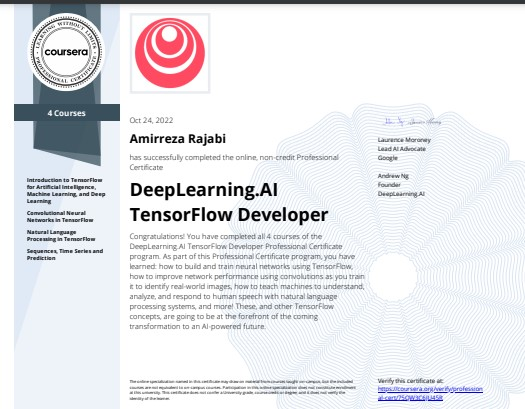

# Tensorflow-Courses

My experiences of learning Tensorflow and the courses I took

*   ##  [DeepLearningAI TensorFlow Developer-Professional Certificate](./)
    * coding with videos files are in [tmp](./tmp/) directory
    *   ### [Introduction to TensorFlow for Artificial Intelligence, Machine Learning, and Deep Learning](./C1-Introduction-to-TensorFlow-for-Artificial-Intelligence-Machine-Learning-and-Deep-Learning)
        *   ####    [week1](./C1-Introduction-to-TensorFlow-for-Artificial-Intelligence-Machine-Learning-and-Deep-Learning/week1/)
        *   ####    [week2](./C1-Introduction-to-TensorFlow-for-Artificial-Intelligence-Machine-Learning-and-Deep-Learning/week2/)
        *   ####    [week3](./C1-Introduction-to-TensorFlow-for-Artificial-Intelligence-Machine-Learning-and-Deep-Learning/week3/)
        *   ####    [week4](./C1-Introduction-to-TensorFlow-for-Artificial-Intelligence-Machine-Learning-and-Deep-Learning/week4/)
        *   ####    [Certificate](./C1-Introduction-to-TensorFlow-for-Artificial-Intelligence-Machine-Learning-and-Deep-Learning/Certificate.pdf)
    *   ### [Convolutional Neural Networks in TensorFlow](./C2-Convolutional-Neural-Networks-in-TensorFlow/)
        *   ####    [week1](./C2-Convolutional-Neural-Networks-in-TensorFlow/week1/)
        *   ####    [week2](./C2-Convolutional-Neural-Networks-in-TensorFlow/week2/)
        *   ####    [week3](./C2-Convolutional-Neural-Networks-in-TensorFlow/week3/)
        *   ####    [week4](./C2-Convolutional-Neural-Networks-in-TensorFlow/week4/)
        *   ####    [Certificate](./C2-Convolutional-Neural-Networks-in-TensorFlow/Certificate.pdf)
    *   ### [Natural Language Processing in TensorFlow](./C3-Natural-Language-Processing-in-TensorFlow/)
        *   ####    [week1](./C3-Natural-Language-Processing-in-TensorFlow/week1/)
        *   ####    [week2](./C3-Natural-Language-Processing-in-TensorFlow/week2/)
        *   ####    [week3](./C3-Natural-Language-Processing-in-TensorFlow/week3/)
        *   ####    [week4](./C3-Natural-Language-Processing-in-TensorFlow//week4/)
        *   ####    [certificate](./C3-Natural-Language-Processing-in-TensorFlow/Certificate.pdf)
    *   ### [Sequences Time Serirs and Prediction](./C4-Sequences-Time-Serirs-and-Prediction/)
        *   ####    [week1](./C4-Sequences-Time-Serirs-and-Prediction/week1/)
        *   ####    [week2](./C4-Sequences-Time-Serirs-and-Prediction/week2/)
        *   ####    [week3](./C4-Sequences-Time-Serirs-and-Prediction/week3/)
        *   ####    [week4](./C4-Sequences-Time-Serirs-and-Prediction/week4/)
        *   ####    [certificate](./C4-Sequences-Time-Serirs-and-Prediction/Certificate.pdf)

